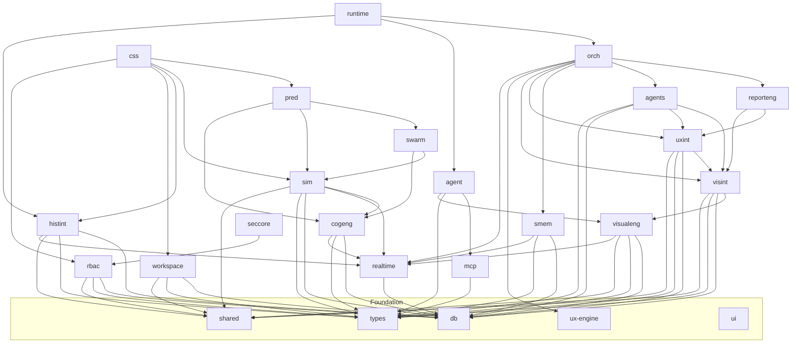

# Architecture Overview – FrictaAI Monorepo

---

## 1️⃣ High‑Level System Diagram

```mermaid
graph TD
  subgraph Frontend[Frontend (React + Vite)]
    FE[React UI] -->|API Calls| BE[Backend API]
    FE -->|WebSocket| RT[Realtime Event Bus]
    FE -->|Telemetry| SDK[Browser SDK]
  end
  subgraph Backend[Backend (Hono + TypeScript)]
    BE -->|Prisma ORM| DB[(PostgreSQL DB)]
    BE -->|Publish| RT
    BE -->|Emit| AG[Agent Orchestrator]
    BE -->|Integrations| INT[Third‑party Services]
  end
  subgraph Packages[Internal Packages @fricta/*]
    DBPkg[db] -->|Prisma client| DB
    RbacPkg[rbac‑core] -->|RBAC checks| BE
    MCPPkg[mcp] -->|Page extraction| SDK
    VisualEng[visual‑engine] -->|Screenshots| SDK
    UXInt[ux‑intelligence] -->|UX analysis| VisualInt[visual‑intelligence]
    CogEng[cognitive‑engine] -->|Cognitive load| UXInt
    SimEng[simulation‑engine] -->|Persona sim| CogEng
    SwarmEng[swarm‑engine] -->|Multi‑persona| SimEng
    PredEng[predictive‑engine] -->|Forecasts| SwarmEng
    Orchestrator[orchestrator] -->|Coordination| AG
    Runtime[runtime] -->|Distributed exec| Orchestrator
    ReportEng[report‑engine] -->|Report assembly| BE
  end
  DBPkg -.->|Shared types| Packages
  RbacPkg -.->|Shared types| Packages
  SDK -->|Capture events| MCPPkg
  SDK -->|Capture screenshots| VisualEng
  SDK -->|Send telemetry| RT
  AG -->|Spawn agents| SimEng
  AG -->|Spawn agents| UXInt
  AG -->|Spawn agents| CogEng
  AG -->|Spawn agents| SwarmEng
  AG -->|Spawn agents| PredEng
  RT -->|Broadcast| FE
```

---

## 2️⃣ Package Dependency Graph (runtime only)

The repository is a **npm workspaces** monorepo managed by **TurboRepo**. 44 internal packages live under `packages/` and follow a clean layered DAG (no cycles).

| Tier | Packages (runtime) | Internal dependencies |
|------|--------------------|-----------------------|
| **0 – Foundation** | `@fricta/config`, `@fricta/types`, `@fricta/shared`, `@fricta/db`, `@fricta/ui`, `@fricta/ux-engine` | – |
| **1 – Capture / Core Services** | `@fricta/mcp`, `@fricta/realtime`, `@fricta/browser-sdk`, `@fricta/visual-engine` | Foundation packages (`db`, `types`, `shared`, `realtime` where needed) |
| **2 – Core Intelligence** | `@fricta/cognitive-engine`, `@fricta/rbac-core`, `@fricta/workspace-core`, `@fricta/workspace`, `@fricta/shared-memory`, `@fricta/historical-intelligence`, `@fricta/developer-platform`, `@fricta/visual-intelligence`, `@fricta/agent` | Foundation + Tier 1 |
| **3 – Domain‑Specific Intelligence** | `@fricta/simulation-engine`, `@fricta/ux-intelligence`, `@fricta/security-core`, `@fricta/predictive-intelligence`, `@fricta/redesign-intelligence`, `@fricta/optimization-intelligence`, `@fricta/enterprise-reporting`, `@fricta/live-intelligence`, `@fricta/forecasting-intelligence`, `@fricta/institutional-intelligence`, `@fricta/autonomous-optimization`, `@fricta/integration-core`, `@fricta/product-strategy`, `@fricta/outcome-intelligence`, `@fricta/portfolio-intelligence`, `@fricta/executive-intelligence`, `@fricta/knowledge-network`, `@fricta/organizational-learning` | All lower tiers |
| **4 – Orchestration & Reporting** | `@fricta/swarm-engine`, `@fricta/agents`, `@fricta/report-engine` | Tier 0‑3 |
| **5 – Global Orchestration** | `@fricta/predictive-engine`, `@fricta/orchestrator` | Tier 0‑4 |
| **6 – Top‑Level Runtime** | `@fricta/runtime`, `@fricta/cross-session-intelligence` | Tier 0‑5 |

### Mermaid visualisation (runtime DAG)


---

## 3️⃣ Core Data Model (Prisma – `@fricta/db`)

> The Prisma schema lives at `packages/db/prisma/schema.prisma`. The generated client is re‑exported from `packages/db/src/index.ts`.

### Central Hub Entities
| Entity | Description |
|---|---|
| **User** | Authored by Clerk, owns `Project[]`, `WorkspaceMember[]` |
| **Project** | Top‑level container for all analysis data |
| **WorkflowSession** | One autonomous agent run – thoughts, actions, screenshots, findings |
| **Organization / Workspace / Team / WorkspaceMember** | Multi‑tenant RBAC backbone |
| **WorkspaceIntegration** | Stores third‑party OAuth tokens (AES‑256‑GCM encrypted at rest via `@fricta/integration-core`'s `OAuthManager`) |
| **UXReport**, **VisualFinding**, **CognitiveSignal**, **SimulationProfile**, **SwarmSession**, **PredictiveRiskSignal**, **HistoricalPattern**, **ExecutiveReport** | Domain‑specific result tables (see package‑level sections for full lists) |

### Model Clusters (by engine)
| Cluster | Representative Models |
|---|---|
| **Agent execution** | `WorkflowSession`, `AgentThought`, `AgentAction`, `InteractionEvent`, `WorkflowMetrics` |
| **Screenshots / visual** | `WorkflowScreenshot`, `ScreenshotTimelineEvent`, `VisualFinding`, `VisualScore` |
| **UX analysis** | `UXReport`, `UXSignal`, `UXRecommendation`, `UXScore`, `UXFinding` |
| **Cognitive** | `CognitiveSignal`, `CognitiveState`, `ConfidenceSignal`, `AttentionEvent`, `ExpectationMismatch`, `DecisionComplexityEvent`, `AbandonmentRiskSignal` |
| **Orchestration** | `OrchestrationSession`, `AgentExecution`, `AgentFinding`, `SharedMemoryEvent`, `CorrelatedFinding` |
| **Simulation** | `SimulationProfile`, `BehavioralDecision`, `ExplorationPath`, `HesitationSignal`, `FrictionReaction` |
| **Swarm** | `SwarmSession`, `PersonaExecution`, `PersonaComparison`, `DivergenceEvent` |
| **Predictive** | `WorkflowForecast`, `PredictiveRiskSignal`, `SurvivabilityForecast`, `AbandonmentPrediction` |
| **Historical** | `HistoricalPattern`, `WorkflowRegression`, `PersonaTrend`, `OrganizationalInsight` |
| **Reporting** | `ExecutiveReport`, `ReportTemplate`, `ReportExport`, `WorkspaceInsightDigest` |
| **Security / audit** | `AuditEvent`, `SecurityEvent`, `ReplayAuditLog`, `GovernancePolicyEvent` |
| **Integrations** | `WorkspaceIntegration`, `IntegrationConnection`, `IntegrationEvent` |
| **Developer platform** | `ApiKey`, `ServiceAccount`, `WebhookEndpoint`, `ApiUsageRecord` |
| **Live intelligence** | `LiveSession`, `TelemetryEvent`, `FrictionSignal`, `UXAnomaly` |
| **Strategy / exec** | `StrategicObjective`, `ProductInitiative`, `ExecutiveMetric`, `Portfolio*` |
| **Knowledge / learning** | `KnowledgeEntity`, `KnowledgeRelationship`, `LearningPattern` |

---

## 4️⃣ Front‑end Module Map (`apps/frontend/src`)

| Folder | Purpose |
|---|---|
| `components/` | Re‑usable React components (cards, charts, timeline visualisers) |
| `features/` | Feature‑grouped logic (e.g., `visuals`, `replay`, `insights`, `orchestrator`) |
| `pages/` | Vite‑router pages – each page composes the feature components |
| `store/` | Zustand global store (`useAppStore.ts`) contains UI state, current workspace, selected project |
| `layouts/` | Layout wrappers – `DashboardLayout.tsx` provides navigation, branding, and the `<Outlet>` |
| `lib/` | API helper (`api.ts`) – thin wrapper around `fetch` that currently returns `any` |
| `index.css` / `tailwind.config.js` | Global styling |

### Data Flow (Frontend → Backend)
1. **User Interaction** – UI events call `api.ts` helpers (`GET/POST`) which return generic `any`.
2. **API Layer** – Calls hit Hono routes under `apps/backend/src/routes/*`. Responses are JSON objects shaped by Prisma models.
3. **Realtime** – WebSocket / SSE from `@fricta/realtime` pushes live telemetry (e.g., UI‑click streams) to the frontend via a custom hook.
4. **Telemetry** – The Browser SDK captures screen recordings, mouse moves, and performance metrics, then POSTs them to `/api/telemetry` (backend stores them via `@fricta/db`).
5. **Orchestrator** – On receipt of new telemetry, the backend spawns agents (`@fricta/agent`) via the orchestrator; results flow back into the DB and are pulled by the UI through subsequent API calls.

---

## 5️⃣ Build / Development Workflow (TurboRepo)

| Step | Command | What it does |
|---|---|---|
| **Install** | `npm i` (root) | Installs all workspace packages and creates `node_modules/.cache` for Turborepo |
| **Type‑check** | `npm run typecheck` | Runs `tsc --noEmit` across the monorepo (strict mode enabled) |
| **Lint** | `npm run lint` | ESLint + Prettier (`@fricta/config`) |
| **Build** | `npm run build` | Calls `turbo run build` → builds each package in parallel respecting the DAG, then bundles frontend with Vite |
| **Dev server** | `npm run dev` | Starts Vite dev server (`apps/frontend`) and Hono backend (`apps/backend`) concurrently (`concurrently` script) |
| **Test** | `npm test` | Jest + Vitest – runs unit and integration tests under `apps/backend/tests` and `packages/*/tests` |
| **Docker** | `docker compose up` | Spins up PostgreSQL, Redis (for queues), and the Node runtime containers |

---

## 6️⃣ Quick Reference – Key Entry Points
- **Backend API root** – `apps/backend/src/index.ts` creates the Hono app, registers all routes (`/api/*`), and applies `clerkMiddleware()`, `hono/secure-headers`, and scoped CORS globally.
- **Frontend entry** – `apps/frontend/src/main.tsx` mounts `<App />` and injects the global store.
- **Orchestrator** – `packages/orchestrator/src/index.ts` exports `Orchestrator` class used by the runtime to schedule agents.
- **Runtime** – `packages/runtime/src/system.ts` starts the distributed worker pool, lock manager, and recovery supervisor.
- **DB client** – `packages/db/src/index.ts` re‑exports a singleton Prisma client (`export const prisma = new PrismaClient();`).

---

*This document is generated from an exhaustive workspace audit performed by Claude Code. It captures the current dependency graph, data flow, and module boundaries for developers, reviewers, and security auditors.*