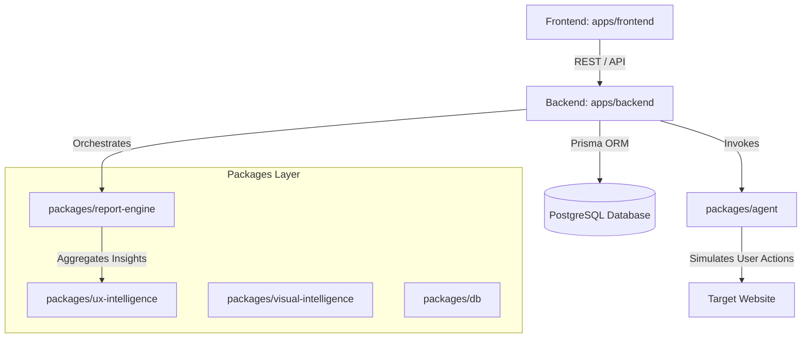

# 🚀 Fricta AI — AI-Native Autonomous UX Intelligence Platform

Fricta is an AI-native autonomous user experience (UX) testing and simulation platform. It emulates realistic user personas and journeys on target websites to uncover usability friction, visual overlapping, layout defects, cognitive barriers, and onboarding leaks before real users ever face them.

---

## 🎨 System Architecture Overview

Fricta is structured as a high-performance **TypeScript monorepo** managed via **npm workspaces** and **Turborepo** for optimized caching, building, and linking.



### 📦 Workspace Breakdown

#### Applications (`apps/`)
* **`apps/frontend`**: A premium, dark-mode dashboard built with **React**, **Vite**, **TypeScript**, **Tailwind CSS**, and **Lucide Icons** showcasing workflow replays, interactive timelines, cognitive simulations, and PDF/Markdown exports.
* **`apps/backend`**: A modular **Hono.js** REST server that handles agent workflow runs, invokes layout/cognitive heuristics, and manages report compilation.

#### Core Libraries (`packages/`)
* **`@fricta/report-engine`**: Centralized orchestration library compiling scoring, executive summaries, chronological event stream correlation, and export builders.
* **`@fricta/ux-intelligence`**: Evaluates cognitive fatigue, onboard drop-off risks, decision overload, and generates custom user persona profiles.
* **`@fricta/visual-intelligence`**: Detects design flaws, overlapping elements, CTA discoverability issues, and generates bounding box telemetry.
* **`@fricta/agent`**: Core headless browser executor simulating autonomous workflows using human-like interaction heuristics.
* **`@fricta/db`**: Database configuration and clients utilizing **Prisma ORM** with **PostgreSQL**.
* **`@fricta/types` / `@fricta/shared`**: Shared type definitions and functional utilities across frontend and backend.

---

## 💎 Features & Capabilities

### 📺 Cinematic Timeline Replay
An immersive visual replay system synchronizing workflow steps with layout overlays. Developers can inspect agent **actions** (clicks, inputs, navigations) side-by-side with underlying **thoughts** (AI reasoning behind actions) at any timestamp.

### 📊 Correlated Event Stream (New)
A dedicated, isolated chronology timeline. It maps events (e.g., clicks, page transitions) in sync with visual and cognitive finding alerts, letting PMs identify the exact moment a user experience degraded.

### 🧠 Cognitive & Persona Simulation
Simulates workflows under multiple cohort configurations:
* **First-Time User**: Scored on onboarding friction and layout readability.
* **Beginner User**: Analyzed for discoverability, hesitation, and guidance gaps.
* **Power User**: Scored on interaction efficiency and click density.
* Exposes **Cognitive Signals** (e.g., *Decision Fatigue*, *Workflow Density*) and **UX Findings** with actionable fixes.

### 📝 Export Engine
Generates premium deliverables on-demand:
1. **Markdown Executive Report**: Formal, readable audit summary.
2. **PM Summary Sheet**: Direct copy-paste format summarizing key severity metrics.
3. **Developer Debug JSON**: Raw session metadata, coordinates, and timings.

---

## 🛠️ Database Schema

Fricta relies on an evidence-centric database architecture. Below are the key tables defined in `schema.prisma`:

| Model | Purpose |
| :--- | :--- |
| `WorkflowSession` | Represents an autonomous run targeting a specific user goal. |
| `UXFinding` | Specific usability issues tagged by severity (e.g., *CTA_AMBIGUITY*, *ONBOARDING_FRICTION*). |
| `CognitiveSignal` | Metric tracking user cognitive overload/fatigue intensity (0.0 to 1.0). |
| `PersonaProfile` | Traits and behavioral weights adjusting threshold checks. |
| `VisualFinding` | Layout defects and bounding box data identified on screenshots. |
| `UXScore` / `VisualScore` | Calculated scoring metrics across Usability Pillars. |

---

## 🔌 API Route Reference

### Workflow & Run Endpoints
* `POST /api/workflows/run`: Dispatches an autonomous agent simulation.
* `GET /api/workflows/sessions/:id`: Retrieves run logs and step statuses.

### Intelligence & Heuristics Engines
* `POST /api/visual/analyze/:sessionId`: Computes layout overlap and visual bounding box overlays.
* `POST /api/ux/analyze/:sessionId`: Evaluates onboarding friction, cognitive load, and persona anomalies.

### Reporting & Exports (Orchestrated by `@fricta/report-engine`)
* `GET /api/reports/:sessionId`: Compiles full unified scorecards and metrics.
* `GET /api/reports/:sessionId/executive`: Pulls grade summaries (`A` to `F`) and risk factors.
* `GET /api/reports/:sessionId/export`: Generates markdown, developer JSON, and PM summary sheet formats.
* `POST /api/reports/:sessionId/generate`: Regenerates scoring and summary structures.

---

## 🚦 Getting Started

### Prerequisites
* **Node.js** >= 18
* **npm** >= 10
* **PostgreSQL** instance running

### Installation

Clone the repository and install all monorepo dependencies:
```bash
npm install
```

### Database Setup

1. Copy `.env.example` to `.env` and configure your `DATABASE_URL`.
2. Generate the Prisma client and push migrations:
```bash
npx prisma generate
npx prisma migrate dev
```
3. (Optional) Run the seed script to populate test sessions:
```bash
npm run seed --workspace=@fricta/db
```

### Run Local Development Servers

Start frontend, backend, and all runner tasks in concurrent watch-mode via Turbo:
```bash
npm run dev
```
* **Frontend**: `http://localhost:5173`
* **Backend REST API**: `http://localhost:3001`

### Running Tests

Run unit tests inside the report engine package to verify scoring structures:
```bash
npx tsx packages/report-engine/src/test-report.ts
```

---

## 🎨 Design Philosophy & UX Elegance
Fricta AI is styled as a state-of-the-art developer platform utilizing custom typography (Outfit / Inter), harmonized color palettes, neon gradients, glassmorphism containers, and reactive hover transitions to keep data interactive and digestible.
